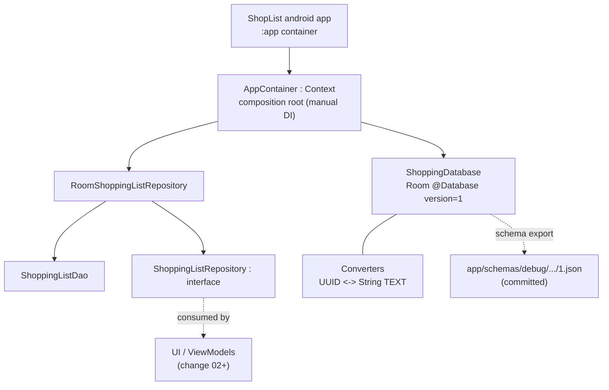

# Design: data-foundation

## Context

Change 01a is complete: the `:app` module builds, launches to a placeholder
(`App()`), and has a manual-DI composition root (`ShopListApp` owns
`AppContainer`) that is currently an empty shell. There is no persistence —
the app holds no data. Change 01b (TASKS.md) establishes the Room-backed data
layer for shopping lists, proven end-to-end by integration tests, so changes
02 (lists screen) and 03 (items screen) build on a tested foundation.

In-force ADRs constraining this design (none superseded): manual DI via
`AppContainer` (0001), single `:app` module with clean packages (0002), Gradle
Kotlin DSL + central version catalog (0003), current-stable dependency policy,
no experimental libraries (0004), package naming `org.mateuszmidor.shoplist`
(0005). ARCHITECTURE.md mandates reactive `Flow` queries from Room, repository/
DAO boundaries, no speculative abstraction, and entities as the pragmatic
domain model.

Stakeholder is the solo author; this is a study project where maintainability
and testability are the point.

### Component diagram (C4, component level, new system)

- `AppContainer` is the single composition root: it owns the `ShoppingDatabase`
  and the `RoomShoppingListRepository`, constructed from the `Context` it gains.
- The repository interface (`ShoppingListRepository`) is the boundary future UI
  depends on; today nothing consumes it yet — 01b only proves the pipeline.
- Room codegen (entities/DAOs/database) runs via KSP; the `androidx.room3`
  Gradle plugin exports the schema JSON so future migrations (03 adds the items
  table) can be validated.

## Goals / Non-Goals

**Goals:**

- Add Room 3.0 + KSP to the build and prove the toolchain end-to-end.
- Deliver a durable, tested lists data layer: entity, converters, DAO (Flow +
  suspend CRUD), database, repository interface + Room implementation.
- Wire the data layer into `AppContainer`, keeping layering boundaries intact
  (UI never touches Room).
- Export and commit the Room schema for future migration validation.

**Non-Goals:**

- No items entity/DAO/repository (change 03).
- No ViewModels, screens, navigation, or any UI beyond the placeholder.
- No domain-model layer or mapping (entity is the domain model per
  ARCHITECTURE).
- No database migrations in this change (version 1 remains current).
- No Hilt/Koin/multi-module structure (ADRs 0001/0002).

## Decisions

### D1. Room 3.0.2 with KSP (Kotlin 2.2.10)
- **Decision**: use `androidx.room3:room3-runtime` 3.0.2 (implementation) and
  `androidx.room3:room3-compiler` 3.0.2 (`ksp`) via the KSP plugin
  `com.google.devtools.ksp` 2.2.10-2.0.2. Imports use the `androidx.room3.*`
  package. DAO one-shot operations are `suspend`; only the reactive read is a
  `Flow`. AGP 9's built-in Kotlin requires
  `android.disallowKotlinSourceSets=false` because this KSP release is the
  newest matching Kotlin 2.2.10 yet still registers sources via the legacy
  `kotlin.sourceSets` DSL (KSP's AGP 9 support ships only with KSP 2.3.x).
- **Rationale**: ADR-0004 mandates current stable. Room 3.0 shipped stable in
  July 2026 (3.0.2 on 2026-08-26); the 2.x line is in maintenance mode, and
  Room 3 is Google's recommended path for new Kotlin projects. It is also
  KSP-only, which is the current Kotlin toolchain.
- **Alternatives**: Room 2.8.4 (rejected: maintenance mode; ADR-0004 explicitly
  rejected "older settled versions for tutorial compatibility"); KAPT as the
  processor (rejected: unsupported by Room 3).

### D2. UUID primary key stored as TEXT via column type converter
- **Decision**: `ShoppingListEntity.id: UUID` is `@PrimaryKey`; a
  `Converters` class maps `UUID <-> String` (TEXT column), applied via
  `@ColumnTypeConverters` on `ShoppingDatabase` (Room 3 renames
  `@TypeConverter`/`@TypeConverters` to `@ColumnTypeConverter`/
  `@ColumnTypeConverters`). Query parameters typed `UUID` are
  converted by Room automatically.
- **Rationale**: TASKS.md fixed ids as UUID (see commit "use UUID instead of
  Long"); UUIDs avoid id-reuse issues and match the future items table's
  references. No auto-generated rowid ids are needed.
- **Alternatives**: `Long` autoincrement ids (rejected in TASKS/A3); storing
  the UUID as a plain `String` field and mapping in the repository (rejected:
  leaks persistence details and duplicates conversion logic).

### D3. Single `data` package for the whole lists storage
- **Decision**: all 01b classes live in `org.mateuszmidor.shoplist.data`:
  `ShoppingListEntity`, `ShoppingListDao`, `Converters`, `ShoppingDatabase`,
  `ShoppingListRepository` (interface), `RoomShoppingListRepository` (impl).
  The items data layer (03) mirrors the same package.
- **Rationale**: ADR-0002 keeps a single `:app` module with clean layers via
  packages; a dedicated `data` package keeps Room out of the UI layer and
  gives 03 a pattern to copy (ARCHITECTURE: "consistency of approaches").
- **Alternatives**: a `data/local` + repository split (rejected as speculative
  structure at this size); placing classes under `ui/` (rejected: violates
  layering).

### D4. Repository exposes the entity directly, no domain model
- **Decision**: `ShoppingListRepository` returns/receives
  `ShoppingListEntity`; no separate domain class or mapper in 01b.
- **Rationale**: ARCHITECTURE: "entities are List/Item; no rich domain
  behaviour" and "no speculative abstraction". The only consumer would be a
  future ViewModel (02), which can map to its own UiState then.
- **Alternatives**: introduce a `ShoppingList` domain class now (rejected:
  boilerplate with no consumer; adds a mapper for no concrete benefit yet).

### D5. Repository owns entity construction
- **Decision**: `RoomShoppingListRepository.create(name): UUID` builds
  `ShoppingListEntity(UUID.randomUUID(), name, System.currentTimeMillis())`,
  inserts it, returns the new id. `rename(id, name)` and `delete(id)` map
  directly to DAO operations.
- **Rationale**: one place owns id/timestamp generation; the returned id lets
  02 navigate straight into a freshly created list.
- **Alternatives**: caller builds the entity and passes it to an `insert`
  (rejected: spreads creation concerns and invites inconsistent timestamps).

### D6. DAO surface: reactive read + suspend writes
- **Decision**: `observeAll()` returns `Flow<List<ShoppingListEntity>>`
  (`SELECT * FROM shopping_lists ORDER BY created_at ASC, id ASC` — `id` as a
  deterministic tiebreaker for same-millisecond creations); writes are
  `suspend insert`, `suspend renameById`, `suspend deleteById` whose SQL
  updates/deletes by `id`.
- **Rationale**: Room 3 requires suspending one-shot queries; the reactive
  stream matches ARCHITECTURE's stateless/storage-to-UI Flow principle. A
  composite order (unchecked-then-checked) is a 03/04 concern, not persisted
  here.
- **Alternatives**: returning `List` reactively via callbacks (rejected:
  `Flow` is the idiomatic reactive primitive and already a declared
  dependency).

### D7. Schema export via the androidx.room3 Gradle plugin
- **Decision**: apply the `androidx.room3` Gradle plugin and set
  `room3 { schemaDirectory("debug", "$projectDir/schemas/debug") }`, with the
  `release` variant mirrored to `schemas/release` (the plugin requires a schema
  location for every variant that exports schemas, so `./gradlew build` needs
  both); export with
  `exportSchema = true`; commit the generated JSON
  (`app/schemas/debug/org.mateuszmidor.shoplist.data.ShoppingDatabase/1.json`).
- **Rationale**: the plugin makes schema output a reproducible, cacheable
  Gradle input/output (per Room 3 docs) and underlies future auto-migration
  validation (ARCHITECTURE data-loss mitigation). The legacy
  `room.schemaLocation` KSP arg is superseded by the plugin.
- **Alternatives**: the KSP arg (rejected: deprecated path in Room 3).

### D8. AppContainer gains a Context
- **Decision**: `AppContainer(context: Context)` constructs the database via
  `Room.databaseBuilder(context, ShoppingDatabase::class.java, "shoplist.db")`,
  the DAO, and the repository; `ShopListApp.onCreate` passes
  `applicationContext`.
- **Rationale**: ADR-0001 — the container is the composition root; a Context is
  the one new dependency it needs. The `ShopListApp` call site is a one-line
  change.
- **Alternatives**: lazy initialization inside an object (rejected: hides the
  graph, violates ADR-0001's single visible wiring point).

### D9. Testing: in-memory Room integration tests + JVM converter test
- **Decision**: `ShoppingListDaoTest` and `RoomShoppingListRepositoryTest` in
  `androidTest` build the database with
  `Room.inMemoryDatabaseBuilder(...)` (fresh DB per test, closed in `@After`)
  and use `kotlinx-coroutines-test` `runTest` + `Flow.first()` for assertions;
  one JVM unit test covers the `Converters` UUID round-trip. Run via
  `./gradlew connectedDebugAndroidTest` on the A52 and `./gradlew test`
  otherwise. The `kotlinx-coroutines-test` version (1.9.0) tracks the
  coroutines-core that the Compose BOM pins for the app, so the test artifact
  is binary-compatible on device.
- **Rationale**: ARCHITECTURE mandates integration tests for the Room data
  layer; in-memory DBs are the standard pattern and avoid polluting the
  device's real database file.
- **Alternatives**: a device-writable real DB file (rejected: leaves artifacts
  on the phone and risks stale state); mocking the DAO (rejected: integration
  is the point).

## Risks / Trade-offs

- [Room 3.0 is a newer API surface with thinner learning material; package and
  driver internals diverge from 2.x guides] -> mitigate with a build smoke
  (`./gradlew assembleDebug`) immediately after dependency scaffolding, keeping
  DAOs to the core suspend/Flow APIs.
- [UUID primary key through a TypeConverter adds an indirection and a TEXT
  column vs a native rowid] -> accepted; ordering is by `created_at`, not the
  id, so the converted column has no sorting cost.
- [KSP is pinned to the Kotlin compiler version; any Kotlin bump must bump KSP
  in lockstep] -> tracked by ADR-0003/0004 policy; single version catalog entry
  makes the upgrade a two-line change.
- [Instrumented tests require a connected device] -> A52 with adb per README;
  the JVM converter test keeps a green signal even without a device.
- [Schema export path is flavor-aware (`schemas/debug/...`) and refactors can
  move it] -> commit the JSON and verify path during the build smoke; harmless
  to adjust before any migration exists.

## Migration Plan

- No runtime data migration: the on-device database does not exist until the
  first run with this change, and stays at version 1.
- Apply steps: catalog + plugins + dependencies -> build smoke -> data-layer
  classes -> container wiring -> tests -> full `./gradlew build` ->
  `connectedDebugAndroidTest` (A52) -> commit generated schema + code.
- Rollback: revert commits; the app returns to the placeholder state. No
  irreversible operations (no released data, no DB on device yet).

## Open Questions

- None blocking. The adoption of Room 3.0 is a durable technology commitment
  likely worth a new repository ADR (0006) in the adr step; no in-force ADR is
  revisited — ADR-0004 already endorses current stable, and this design is
  coherent with ADR-0001/0002/0003/0005.
- Verify during implementation that Room 3.0's `Room.inMemoryDatabaseBuilder`
  remains available in `room3-runtime` for the integration tests (assumed; falls
  back to a temporary-file database if the API differs).