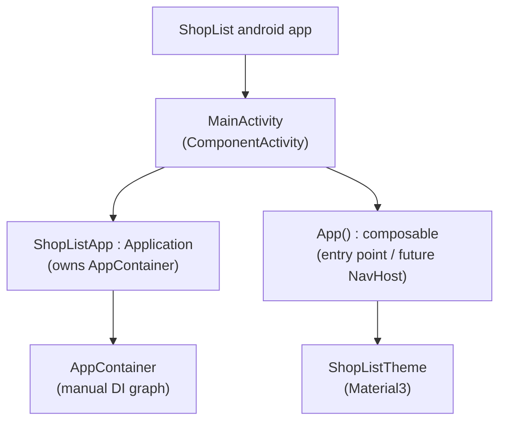

# Design: project-scaffolding

## Context

The repo is at the default Android Studio empty-activity template state. The build
toolchain (AGP 9.3.2, Kotlin 2.2.10, Compose BOM 2026.02.01, compileSdk 37,
minSdk 30 / targetSdk 37) already compiles; `MainActivity` shows a template
`Greeting("Android")` placeholder. Nothing in the app is wired to the
`com.example.shoplist` placeholder package, there is no `Application` class and no
dependency graph yet. No ADRs exist in `<repo>/adr/` (empty), so there are no
in-force ADRs constraining this design.

The single stakeholder is the solo developer/author. Goal for this change: prove
the toolchain and establish clean app-entry wiring before any Room/data-layer
work (01b).

### Composition root (lightweight C4, component level)

- `ShopListApp` is the process-wide scope registered via `android:name`; it owns
  the single `AppContainer` instance shared app-wide.
- `MainActivity` is the thin Activity shell: it reaches the container through
  `(application as ShopListApp).container` and renders `App()` inside the theme.
- `App()` is the stable UI entry point where 02/03 later mount lists/items
  navigation; today it just shows a placeholder.
- `AppContainer` is currently empty; 01b fills it with the Room database and
  repositories. `ShopListTheme` is existing template code, unchanged.

## Goals / Non-Goals

**Goals:**
- Rename the base package/namespace/applicationId to `org.mateuszmidor.shoplist`.
- Introduce a manual-DI composition root: `ShopListApp : Application` +
  `AppContainer` (empty shell), reachable from `MainActivity`.
- Replace the template `Greeting("Android")` placeholder with an empty `App()`
  composable as the app entry point.
- Register `ShopListApp` in the manifest and confirm the app still builds, its
  smoke tests pass on the JVM and on-device, and it launches on the emulator.
- Record the foundational architecture decisions as durable ADRs.

**Non-Goals:**
- No Room/data-layer behavior, no `ShoppingListEntity`/DAO/repository (01b).
- No KSP/Room/Navigation dependencies (01b+).
- No feature UI beyond the empty `App()` placeholder.
- No DI framework, no multi-module split (decided here, implemented later if ever).

## Decisions

### D1. Rename package to `org.mateuszmidor.shoplist`
- **Decision**: set `namespace` and `applicationId` to `org.mateuszmidor.shoplist`;
  move `app/src/main/java` and `app/src/test`/`androidTest` sources into
  matching directories; update imports and the manifest.
- **Rationale**: `com.example` is a template placeholder. Renaming is trivial now
  (few files, no published artifact) and expensive later (package dirs, imports,
  applicationId, backup/queries). A personal, never-published app still benefits
  from a real, stable applicationId.
- **Alternatives**: keep `com.example.shoplist` (rejected: placeholder, painful to
  change later); a different base domain (rejected in favor of the author's
  chosen `org.mateuszmidor.*`).

### D2. Composition root: `Application` + `AppContainer` (manual DI)
- **Decision**: introduce `ShopListApp : Application` that owns an `AppContainer`
  instance; `MainActivity` retrieves it via `(application as ShopListApp).container`.
  `AppContainer` is a plain class holding dependencies (initially empty; later
  Room database + repositories).
- **Rationale**: matches ARCHITECTURE's "manual DI, no Hilt/Dagger". A hand-wired
  object graph is simplest to reason about for a learning project and needs no
  annotation processing; the whole graph lives in one visible place.
- **Alternatives**: Hilt (rejected: framework + KSP complexity not yet needed,
  ARCHITECTURE explicitly excludes a DI framework); Koin (rejected: runtime DI,
  not needed at this scale); passing deps through `MainActivity` only (rejected:
  no single composition root to share with future ViewModels).

### D3. App entry: empty `App()` composable
- **Decision**: `MainActivity.setContent { ShopListTheme { App(container) } }` where `App()`
  renders the placeholder body. Later changes grow `App()` into the NavHost.
- **Rationale**: a single stable entry point keeps navigation (`compose`) wiring
  in one function for feature changes (02/03). The placeholder body stays visible
  so 01a is verifiable on device without visual regression.

### D4. Keep and repair template smoke tests
- **Decision**: move `ExampleUnitTest.kt` (JVM) and `ExampleInstrumentedTest.kt`
  (androidTest) to the new package and fix assertions/imports.
- **Rationale**: proves both test toolchains run end-to-end, matching
  ARCHITECTURE's HIGH testability. Cheap and de-risks the test plumbing before
  real unit/integration tests arrive (01b+).
- **Alternatives**: delete them (rejected: loses a smoke signal that the JVM and
  instrumented test runners actually run).

## Risks / Trade-offs

- [Package rename misses a hidden reference (manifest, build files, imports)] ->
  rename is the riskiest step; mitigate with a full `./gradlew build` and a
  repo-wide search for `com.example.shoplist` (expect zero hits after).
- [Empty `App()` keeps showing the placeholder, so 01a looks 'unchanged' on
  device] -> expected and intended; verification is that it still builds/tests/
  launches, not that the screen changed.
- [Manual DI boilerplate grows as repos/ViewModels multiply] -> accepted tradeoff
  for a small single-user app; revisit via ADR only if the graph gets unwieldy.

## Migration Plan

- No runtime data migration (no persisted data yet).
- Steps: rename package -> add `ShopListApp`/`AppContainer`/`App()` -> wire
  manifest -> build -> run JVM unit tests -> launch on emulator (manual smoke) ->
  run instrumented test if the emulator is available.
- Rollback: revert the rename/wiring commits; the app returns to the template
  state. No irreversible operations are introduced.

## Open Questions

- None blocking. Running the instrumented `ExampleInstrumentedTest` requires an
  emulator/device; if unavailable during apply, verification falls back to JVM
  tests + `assembleDebug` + emulator launch manually.
- The foundational ADRs to be recorded in the adr step (not superseding anything,
  since none exist): manual DI, single module, Gradle Kotlin DSL + version
  catalog, dependency/version policy, package naming.
