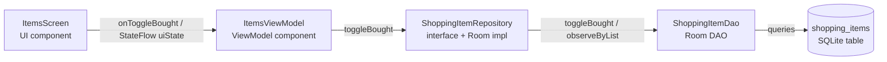
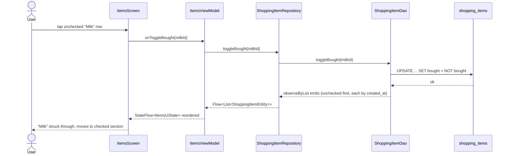

## Context

The app is a single `:app` module with manual DI (`AppContainer`), Room 3.0 storage, Navigation Compose, and MVVM screens sourced via `viewModel { ... }` CreationExtras (ADR-0008). Change 03 delivered the items screen with the `bought` column already present on `ShoppingItemEntity` — but nothing reads or writes it. Change 04 makes bought visible and useful: tap a row to mark it bought, show a clear visual, and keep checked items out of the way at the bottom while shopping.

Current touch points:

- `ShoppingItemDao.observeByList` orders by `created_at ASC, id ASC` only (no bought in ordering, no toggle query).
- `ShoppingItemRepository` / `RoomShoppingItemRepository` expose create/rename/delete — no bought operation.
- `ItemsViewModel` mirrors exactly that: add/rename/delete.
- `ItemRow` already has an empty `onClick = {}` inside `combinedClickable` — the tap hook exists but is unused.

## Goals / Non-Goals

**Goals:**
- Tapping an item (row or checkbox) toggles its `bought` flag, persisted to Room.
- Bought items render with a checked checkbox and a struck-through, dimmed label.
- Display is two sections: unchecked items first, then checked items; within each section, ordered by creation time (earliest first). Unchecking returns an item to its creation-time position.
- Covered by unit tests (ViewModel + fake), DAO integration tests (ordering + toggle), and a full round-trip integration test.

**Non-Goals:**
- Section headers or dividers between unchecked/checked groups (visual polish, deferred).
- Animations for items moving between sections.
- Manual reordering, quantities/units, per-list bought counts (Change 05).
- Explicit `setBought`/batch operations — only a user-initiated toggle.

## Decisions

### Decision 1: Ordering lives in the DAO as SQL `ORDER BY`

`observeByList` becomes:

```sql
SELECT * FROM shopping_items
WHERE list_id = :listId
ORDER BY bought ASC, created_at ASC, id ASC
```

Room encodes `Boolean` as SQLite `INTEGER` 0/1, so `bought ASC` places unchecked (0) items first with no expression magic. The ordering is a pure function of `(bought, createdAt)` — there is no stored position, so unchecking automatically restores creation-time order with zero extra logic.

- *Alternative considered:* sorting in the ViewModel. Rejected — Change 03 already established ordering at the DAO (single source of truth for stream order), and screens/UI stay thin mirrors of the storage-backed stream (ADR-0008).

### Decision 2: Toggle is an atomic SQL flip

```sql
UPDATE shopping_items SET bought = NOT bought WHERE id = :id
```

Exposed as `toggleBought(id)` on DAO, repository interface, and Room implementation.

- *Alternative considered:* `setBought(id, value)` with the ViewModel computing `!current.bought` from `uiState`. Rejected — `NOT bought` is atomic (no read-then-write), matches the exact "toggle" semantics of the requirement, and keeps the write path one round-trip.

### Decision 3: ViewModel follows the established write path

`ItemsViewModel.toggleItemBought(id)` delegates to `repository.toggleBought(id)` inside `viewModelScope`; state continues to arrive reactively through the observed Flow. No new pattern (ADR-0008).

### Decision 4: Row = `Checkbox` + struck-through text, whole row toggles

`ItemRow` becomes a `Row` holding a Material3 `Checkbox` (`checked = item.bought`, `onCheckedChange = { onToggle(item.id) }`) and the item text, wrapped in the existing `combinedClickable` — `onClick` now toggles instead of being empty, `onLongClick` keeps the rename/delete menu. Bought text uses `TextDecoration.LineThrough` with `MaterialTheme.colorScheme.onSurfaceVariant` for the dimmed look.

The `Checkbox` consumes its own pointer events, so there is no double-fire: tapping the checkbox toggles once via `onCheckedChange`, tapping elsewhere on the row toggles once via the row's `combinedClickable`. No new dependency — `Checkbox` ships in material3 already used.

- *Alternative considered:* leading checkmark `Icon` (Listonic-style) without strikethrough. Rejected — a checkbox's checked/unchecked affordance is unambiguous, and the material-icons artifact is not currently a direct dependency.

### Decision 5: The fake repository mirrors data-layer ordering

`FakeShoppingItemRepository` sorts emitted items by `(bought, createdAt, id)` after any mutation and implements `toggleBought`. This keeps ViewModel unit tests exercising the same ordering contract the DB enforces, so passing unit tests plus the DAO integration test give coverage without a device.

## Risks / Trade-offs

- [DAO ordering and fake ordering can diverge] -> The DAO integration test is the authority for ordering; the fake's mirroring is documented and covered by explicit ViewModel unit tests, and the fake sorts via a shared comparator to a single ordering expression.
- [`bought ASC` relies on Room's Boolean→INTEGER 0/1 encoding] -> Standard, stable Room behavior; asserted directly by the DAO integration ordering test.
- [`NOT bought` is not idempotent] -> Correct for a UI toggle with a single writer; no batching in scope, and clicking the same row twice simply flips twice, which is the desired interaction.
- [Checkbox inside a clickable row could double-toggle] -> Compose Checkbox consumes its input (validated in practice on the target device); both handlers call the same `onToggle(item.id)`, so even a stray double-invocation converges to one flip per user intent.
- [Tapping the row moves text under the finger while checking] -> Accepted trade-off for row-sized tap targets; the checkbox remains the precise control.

## Migration Plan

No database migration: the `bought` column has existed since Change 03, so the Room schema version is unchanged and existing installs upgrade with no schema step.

Deploy = normal app update. Rollback = revert the change; new ordering is a superset of the old one (all-unchecked data orders identically), so there is no data migration either direction.

## Open Questions

None blocking. No in-force ADR needs supersession; this change is fully coherent with ADR-0001/0006/0008/0009.

Deferred (captured as non-goals): optional "Bought" section divider and cross-section animation — later polish if the visual split feels weak.

## Diagrams

Component-level view (static structure):



Dynamic view (toggle flow):

