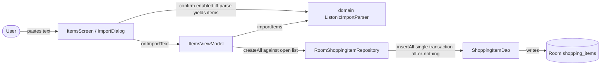

# import-items — Design

## Context

The items screen today supports only single-item creation: a FAB (+) opens a
one-line `NameDialog` and `ItemsViewModel.addItem` calls
`repository.create(listId, name)`, which inserts one entity with a fresh
`System.currentTimeMillis()` timestamp. Display order is enforced by
`ShoppingItemDao.observeByList` as `ORDER BY bought ASC, created_at ASC, id ASC`,
so within the unchecked section creation time is the ordering key.

The app has no parsing logic and no `domain` package yet — business logic
currently lives in the ViewModels and repositories. The user is migrating
everyday lists from the Listonic app and wants to paste a list's text export
into an open list to append all its items at once.

Constraints in force (no supersessions: no ADR in `adr/` references
`Supersedes`, so ADR-0001..0010 are all live):
manual DI via `AppContainer` (ADR-0001), single `:app` module (ADR-0002),
current-stable dependencies (ADR-0004), `org.mateuszmidor.shoplist` package
root (ADR-0005), Room 3 via KSP (ADR-0006), type-safe nav routes (ADR-0007),
ViewModels sourced via CreationExtras, reads via `Flow`, writes via repository
(ADR-0008), items scoped to lists with cascade delete (ADR-0009), derived
aggregates computed in the data layer (ADR-0010). None of these is contradicted
by this design.

## Goals / Non-Goals

**Goals:**
- A pure, JVM-testable parser converting pasted text into item names, living in
  a new `domain` layer.
- An atomic batch-append operation in the item data layer
  (`createAll(listId, names)`) — all-or-nothing, import order preserved.
- Items screen entry points: a FAB menu ("Add item" / "Import from Listonic")
  and a multi-line import dialog targeting the open list, with the confirm
  action blocked while the pasted text yields no items.
- `ItemsViewModel.importItems(text)` wiring the flow, with an empty parse
  result never reaching the data layer.
- Tests at three levels: parser (JVM), ViewModel import action (JVM, fake
  repo — success + blocked cases), and atomic batch import (instrumented).

**Non-Goals:**
- Importing from the lists screen (target is always the open list, per
  TASKS.md change 06).
- Deduplicating against existing list items or within the paste (duplicates
  are kept, per change 06).
- A UI import summary / snackbar (the app has no snackbar pattern yet).
- `strings.xml` extraction (deferred to the polish change per project
  decision).
- Quantities/units, manual reordering — out of scope (ARCHITECTURE.md).
- UI automation tests — deferred per ARCHITECTURE.md.

## Import Flow (lightweight component diagram)



- The **ItemsScreen** owns the two entry points (FAB menu, import dialog) and
  is the only place a paste enters the system; the confirm gate consults the
  parser for enablement only.
- **ListonicImportParser** is the pure component — no storage, no Android
  types; both the UI (enablement) and the ViewModel (content) depend on it.
- **ItemsViewModel** is the single write path (ADR-0008): it parses, blocks
  empty results, and delegates the batch to the repository.
- The **repository/DAO chain** is unchanged in responsibility — the repository
  generates identity, the DAO persists — with the new `createAll`/`insertAll`
  pair adding batch semantics; the database schema is untouched.
- Assumption: a paste always targets the currently open list (no selector), so
  no list-selection component exists in the flow.

### 1. Introduce a `domain` package for the pure parser

`ListonicImportParser` is stateless, deterministic, and pure Kotlin with zero
Android dependencies. ARCHITECTURE.md places business logic in ViewModels *and
dedicated domain logic*; this is the first such dedicated unit. It lives at
`org.mateuszmidor.shoplist.domain.ListonicImportParser` (ADR-0005), exposing
`object ListonicImportParser { fun parse(text: String): List<String> }`.

Parsing rules (per TASKS.md + grilling decisions):
- split on newlines (`\n`, tolerating `\r\n` via trimming);
- trim surrounding whitespace per line;
- strip one leading bullet from `{'•', '-', '*'}` plus any following whitespace;
- skip lines that end up empty (including a bare bullet);
- keep duplicates verbatim;
- preserve `/` inside names (e.g. `chleb ciemny/bułki` stays as-is).

Returns names only (`List<String>`) — nothing is materialized into entities
here; identifier/timestamp generation belongs to the data layer (decision 3).

_Alternatives:_ placing the parser in `data/` (blurs the layer seam) or
`ui/items` (couples parsing to presentation) — rejected; the new `domain`
package is the cleanest home for pure logic and becomes the future seam for
similar text/format concerns.

### 2. Import confirmation is gated by the live parse result

The dialog's confirm button is enabled iff
`ListonicImportParser.parse(text).isNotEmpty()`. This blocks imports even for
text that is non-blank but parses to nothing (e.g. `"•"`, `"---"`, or
whitespace-only lines). The UI may invoke the pure parser for this enablement
check — it reads no storage and performs no writes, so layering stays intact.
The ViewModel repeats the guard as a safety net (decision 5).

_Alternatives:_ enabling on `text.trim().isNotEmpty()` alone and letting the
ViewModel silently no-op — rejected during exploration: the confirm button
would appear active for pastes that import nothing.

### 3. Atomic batch append: `@Insert` of a pre-generated entity list

The DAO gains `@Insert suspend fun insertAll(items:
List<ShoppingItemEntity>)`. Room wraps the batch in a single transaction, so
all rows land or none do (all-or-nothing) without explicit
`db.withTransaction` ceremony.

`ShoppingItemRepository` gains `suspend fun createAll(listId: UUID, names:
List<String>): List<UUID>`. `RoomShoppingItemRepository` generates a UUID and a
creation timestamp per name, then calls `insertAll` and returns the generated
IDs.

To preserve pasted order under the `created_at, id` sort, timestamps are
*sequential*: `createdAt = base + index`. A shared timestamp would order the
batch by random UUIDs and scramble the pasted list.

_Alternatives:_ (a) `db.withTransaction { names.forEach { dao.insert(...) } }`
— redundant machinery with no extra atomicity; (b) one shared timestamp for
the batch — rejected, scrambles order; (c) repository returns nothing — a
return value keeps the repository consistent with the existing `create(...)`
contract and lets callers (and tests) observe the generated IDs.

### 4. Items screen entry points: FAB menu + private import dialog

The FAB stays a `FloatingActionButton` showing "+"; tapping it now opens an
anchored `DropdownMenu` (the same pattern already used for item/list rows)
with "Add item" (opens the existing create dialog) and "Import from Listonic"
(opens the new import dialog). Menu visibility is a `rememberSaveable` boolean.

The import dialog is a private composable inside `ItemsScreen.kt`
(per project decision: dialogs stay private to each screen, mirroring
`ListsScreen`). It contains a multi-line `OutlinedTextField` (about 4 lines),
a confirm button whose enablement follows decision 2, and a cancel button that
closes without importing. No list selector — the target is the open list.

_Alternatives:_ an `ExtendedFloatingActionButton` text toggle, or two stacked
FABs — rejected for consistency with the existing "+" interaction; hoisting a
shared dialog component — rejected per the standing project decision.

### 5. `ItemsViewModel.importItems(text)` follows ADR-0008

```
importItems(text):
  parsed = ListonicImportParser.parse(text)
  if (parsed.isEmpty()) return          // blocked: no data-layer call
  repository.createAll(listId, parsed)  // inside viewModelScope
```

This mirrors the existing write path (`addItem`/`renameItem`/`deleteItem` all
delegate to the repository in `viewModelScope`) and keeps the ViewModel thin
and fake-testable.

### 6. Test strategy

- **JVM — `ListonicImportParserTest`**: bullet stripping (`•`, `-`, `*`),
  whitespace trimming, blank/bare-bullet lines skipped, duplicates kept,
  slashes preserved, CRLF handling, empty input → empty list.
- **JVM — `ItemsViewModelTest`** (extended; `FakeShoppingItemRepository`
  gains `createAll` mirroring the ordering fake already models): successful
  import appends all parsed items in pasted order to the target list; import
  of non-parseable text emits no change and never calls the repository;
  cross-list isolation holds.
- **Instrumented — `RoomShoppingItemRepositoryTest`** (extended): `createAll`
  persists every item scoped to the list with sequential timestamps (order
  preserved); and an **atomicity case**: a batch in which one entity violates
  the `list_id` foreign key throws and **no** rows are persisted — pinning the
  all-or-nothing behaviour empirically.

## Risks / Trade-offs

- [UI composable calls the domain parser for confirm enablement]
  → Acceptable: the function is pure and side-effect free; the ViewModel
  remains the single write path (ADR-0008); the parser lives in `domain`, not
  in UI, so the layering intent is preserved.
- [Lenient leading-bullet strip could mangle names starting with `-` or `*`]
  → Accepted during grilling; grocery item names rarely start with those
  characters; `•` (the real Listonic export) is unaffected.
- [Sequential `createdAt = base + index` assumes the batch sits at the tail]
  → Imported items are new, so `base` (now) exceeds existing timestamps and
  the batch lands at the end of the unchecked section in pasted order; the
  existing `id` tiebreak covers same-ms collisions.
- [Atomicity rests on Room's `@Insert(List)` single-transaction semantics]
  → Standard Room behaviour (ADR-0006); the FK-violation rollback test pins it
  so a future Room/database change cannot silently break all-or-nothing.
- [New `domain` package is a structural first]
  → Deliberate and minimal (one pure object); recorded in the `adr` step as a
  durable decision rather than a speculative layer.

## Migration Plan

No schema change — `createAll` adds an insert path only, so the Room schema
version stays 1 and no migration is needed. No deployment involved (local
app). Rollback is reverting this change; existing list/item data is untouched
and retained.

## Open Questions

- None blocking. Verify empirically at implementation time:
  - Room 3 `@Insert(List)` commits the batch in one transaction (the FK-violation
    rollback test proves it).
  - The FAB `DropdownMenu` anchors correctly inside the existing Scaffold on
    the target device.
- New durable ADR to record in the `adr` step: the introduction of the
  `domain` package as the home for pure business logic. **No in-force ADR is
  superseded or revisited** by this design.