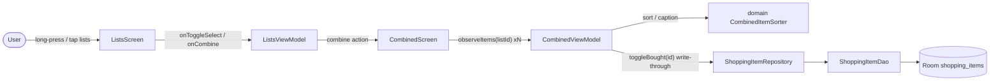

# combined-view — Design

## Context

The app today has two screens — lists and items — with items scoped to a single
list (ADR-0009). Each list's items are displayed by
`ShoppingItemDao.observeByList` as `ORDER BY bought ASC, created_at ASC, id ASC`;
`ItemsViewModel` combines that flow with the list name into an `ItemsUiState`
(ADR-0008). The lists screen shows per-list summaries from a single data-layer
query (ADR-0010) and exposes list actions via a long-press context menu
(rename/delete/export).

The user shops from several lists at once (e.g. two recipe lists) and wants a
transient view merging them. The combined view must be single-use, support only
checking/unchecking, and write through to the owning lists so the originals stay
authoritative. This change introduces a third screen and reworks the lists
screen's long-press interaction to free long-press for multi-select.

Constraints in force (no supersessions: no ADR references `Supersedes`, so
ADR-0001..0011 are all live): manual DI via `AppContainer` (ADR-0001), single
`:app` module (ADR-0002), `org.mateuszmidor.shoplist` package root (ADR-0005),
Room 3 via KSP (ADR-0006), type-safe nav routes (ADR-0007), ViewModels sourced
via CreationExtras, reads via `Flow`, writes via repository (ADR-0008), items
scoped to lists with cascade delete (ADR-0009), derived aggregates computed in
the data layer (ADR-0010), pure business logic in `domain` (ADR-0011).

## Goals / Non-Goals

**Goals:**
- A third screen — the combined view — reachable from the lists screen, showing
  a transient merge of the selected lists' items.
- A lists-screen multi-select mode entered by long-press, with a "Combine" top
  bar action (enabled with ≥1 selected) that opens the combined view; system
  back cancels selection.
- Move rename/delete/export off the lists long-press into a per-row overflow
  menu (⋮) with rename, export, and delete actions (freeing long-press for
  selection).
- Combined view properties: flat items, each captioned with its source list,
  duplicates concatenated, standard split (unchecked top / checked bottom),
  sorted by name within each section with equal names ordered by creation time,
  check/uncheck only, write-through to owning lists, discarded on exit.
- Tests: JVM for the sort/merge logic and the combined ViewModel; JVM for the
  lists selection mode; instrumented integration for the combined feature and
  the write-through toggle.

**Non-Goals:**
- Saving/reusing a combined group (transient by design — no persistence of the
  selection).
- Deduplicating or grouping identical item names across lists (concatenated and
  captioned instead).
- Add/rename/delete inside the combined view (check/uncheck only).
- Changing the items screen's long-press menu (unaffected; only the lists
  screen selection changes).
- Combining a single list (allowed but identical to opening it — no special
  handling).
- Room schema change or migration (none needed; the combined view is a derived
  composition of existing item flows).
- UI automation tests (deferred per ARCHITECTURE.md).

## System Context / Component Diagram

The combined view is a third destination in the existing NavHost. It reads a
set of list ids from its route, composes the per-list item flows into one
state, and routes toggles back through the item repository (the single write
path, ADR-0008).

- **ListsScreen** owns the new selection-mode UI and the per-row overflow menu
  (⋮) exposing rename/export/delete; it no longer opens the rename/delete
  context menu on long-press.
- **ListsViewModel** holds the transient selection state (which list ids are
  selected) and exposes the "Combine" action that navigates with the selected
  ids.
- **CombinedViewModel** (ADR-0008) composes several `observeItems(listId)`
  flows into one `StateFlow`, maps each item to a `(name, bought, createdAt,
  sourceListName)` row, and delegates `toggleBought(id)` to the repository —
  writing through to the owning list by the item's existing `listId`.
- **domain CombinedItemSorter** is a pure function (ADR-0011) that orders a
  flat set of rows: unchecked before checked, then by name, then by createdAt.
- **Item repository/DAO** is unchanged in responsibility; the combined view
  reuses `observeItems` and `toggleBought` and adds no schema.

### 1. Combined route carries a list of list ids

The combined screen is a new `@Serializable` route `Combined(listIds:
List<ListId>)`. Navigation Compose cannot defer a `List<ListId>` argument to
the existing single-UUID `ListIdNavType` (ADR-0007's typeMap is per-type and
has no natural `NavType` for a list of UUIDs in default autosave).

Decision: serialize the selection in the route as the canonical comma-joined
UUID strings and expose the route as a component holding a `List<UUID>` that
the destination reconstructs.

Rationale:
- The route stays type-safe and compile-checked like the existing `ListId`
  wrapper (ADR-0007), keeping a single `UUID` domain type.
- The combined view is transient, so encoding the selection inline in the route
  is appropriate — there is no persistent session id to look up (non-goal).
- The helper is a single custom `ListIdListNavType` (mirroring `ListIdNavType`)
  that joins the list argument into one comma-separated route value and splits
  it back; the existing `ListId` serializer is reused to encode each element.

_Alternatives:_ (a) a single opaque session token the CombinedViewModel resolves
— rejected: introduces a transient session store that is a second source of
truth and contradicts the "no state, discarded on exit" property; (b) a native
collection `NavType<List<UUID>>` (multi-value encoding) — rejected: the
joined-string form keeps the route a single opaque argument, matching how the
existing `ListIdNavType` encodes.

### 2. Lists selection mode lives in ListsViewModel UI state

ListsViewModel gains a `selection: Set<UUID>` and a `selectionMode: Boolean` in
its `ListsUiState`. Long-press on a row enters selection mode and selects that
list; subsequent taps toggle a row in/out of selection; system back clears
selection and exits selection mode; the "Combine" action navigates with the
current `selection`.

Check/uncheck feedback follows existing ordering: selection is derived from a
per-row UI state held transiently in the ViewModel, never persisted (matching
the transient nature of the feature), so no repository change is needed for
selection.

_Alternatives:_ persisting selection in data layer — rejected; selection is
transient UI state, not a domain fact (per ADR-0008 the ViewModel may hold
per-screen coordination state).

### 3. Rename/delete/export move to a per-row overflow menu on the lists screen

Today long-press opens a `DropdownMenu` with rename/delete (and export from
change 07). Because long-press now enters selection mode, rename/delete/export
must be reachable another way. Each lists screen row gains a single overflow
menu button (⋮) that opens a `DropdownMenu` offering rename, export items, and
delete — a compact alternative to three persistent row icons that keeps the
row uncluttered. Export (change 07) moves from the long-press context menu into
that same overflow menu.

_Alternatives:_ keeping long-press for the menu and using a distinct gesture for
selection — rejected: the user explicitly chose long-press for selection, and
two overlapping long-press semantics would be ambiguous.

### 4. CombinedViewModel composes per-list flows; sorting is a pure domain function

Following ADR-0008, `CombinedViewModel` builds its `StateFlow` by combining the
`observeItems` flows of every selected list into a single `Flow<ItemsUiState>`.
Each emitted item is paired with its owning list's name (looked up from
`observeList`) to form the source caption.

Ordering follows ADR-0011: `CombinedItemSorter` in `domain` is a pure function
taking a flat set of `(name, bought, createdAt)` rows and returning them ordered
by `bought` (unchecked first), then `name`, then `createdAt`. Pinning the sort
in `domain` makes it JVM-testable without Android, keeps the ViewModel a thin
mapping layer, and follows the seam ADR-0011 established.

_Alternatives:_ pushing the merge/sort into a Room query — rejected: the
selection is dynamic (arbitrary N lists) and transient, so a fixed SQL query
would need dynamic `IN` lists; composing existing per-list `Flow`s in the
ViewModel is simpler and keeps the write-through and caption lookup natural.
This does not contradict ADR-0010 (which governs derived *aggregates* — counts —
in the data layer); the combined view is a *composition* of existing rows, not
a new aggregate, and per-list ordering is already enforced by the DAO.

### 5. Write-through toggle reuses the existing repository path

Toggling in the combined view calls `repository.toggleBought(item.id)`. Because
the item entity owns its `listId` (ADR-0009), routing to the correct owning list
is inherent — no explicit list context is needed in the call. The original
lists and the combined view observe the same rows (ADR-0008 reads-via-Flow), so
a toggle in the combined view immediately reflects in the owning list and vice
versa. The combined view holds no state of its own, so on exit there is
nothing to commit and nothing lost.

### 6. Test strategy

- **JVM — `CombinedItemSorterTest`**: unchecked-before-checked; name ordering;
  equal-name tiebreak by createdAt; determinism with identical
  (name, createdAt) via a stable id fallback.
- **JVM — `CombinedViewModelTest`** (fakes for `observeItems`/`observeList`):
  merges items from several lists with correct source captions; concatenates
  duplicates; exposes ordered rows; `toggleBought` delegates to the repository
  with the correct item id.
- **JVM — `ListsViewModelTest`** (extended): selection mode enter/exit, toggle
  selection, "Combine" surfaces the selected ids, back clears selection.
- **Instrumented — combined feature integration**: observing a combined view
  over real Room lists reflects merged items, and toggling writes through to
  the owning list (row's `bought` flips in the source list).

## Risks / Trade-offs

- [Route with a list of UUIDs diverges from ADR-0007's single-UUID NavType]
  → Mitigation: the route stays type-safe and reuses the existing `ListId`
  serializer per element; only the container (comma-joined string) diverges.
  Recorded in the `adr` step as a deliberate extension rather than a silent
  deviation.
- [Long-press previously offered rename/delete; moving to an overflow menu
  changes a familiar interaction]
  → Accepted per user decision; a single ⋮ menu is visible per row and free of
  clutter, replacing the earlier plan for three per-row icon buttons. Existing
  `specs/lists-screen` long-press requirements are revised in the `specs` step.
- [Transient inline-encoded selection: a rotation/recreation of the combined
  destination must reconstruct the selection from the route]
  → Mitigation: the selection is fully encoded in the `Combined` route itself,
  so configuration changes are safe without any extra state.
- [CombinedView sorting by name globally interleaves lists — items from
  different lists no longer appear in source blocks]
  → Accepted per user decision (name-sorted so duplicate names cluster); the
  source caption preserves the association the user needs while aisle-hopping.
- [Reactive composition over many lists could be chatty]
  → Bounded by the user's real usage (a handful of lists); per-list flows are
  already cheap single-table queries; acceptable for the target device.

## Migration Plan

No persistence/schema change — the combined view is a derived composition of
existing item rows, the Room schema version stays 1, and no migration is
needed. No deployment involved (local app). Rollback is reverting this change;
existing list/item data is untouched and retained. The only observable
behaviour change on rollback is the lists screen long-press reverting to the
context menu.

## Open Questions

- The single per-row overflow menu (⋮) with rename/export/delete fits without
  cluttering the summary layout on the target device (Samsung Galaxy A52) —
  verified at device time.
- New durable ADR to record in the `adr` step: the combined route carrying a
  list of list ids (a deliberate, small extension of ADR-0007's single-UUID
  argument convention). **No in-force ADR is superseded or revisited** by this
  design.

Empirically verified at implementation time (Navigation 2.10.0 source:
`RouteSerializer.computeNavType`): Navigation only resolves NavTypes for
primitive and primitive-collection arguments natively; a `List<ListId>`
argument requires a custom NavType registered for the whole list KType in the
destination `typeMap`. `ListIdListNavType` provides that and round-trips the
list as comma-joined canonical UUID strings (UUID canonical form never contains
a comma, so the join is lossless).
